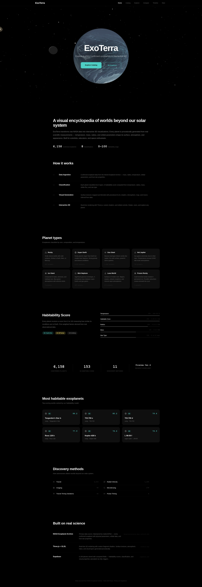
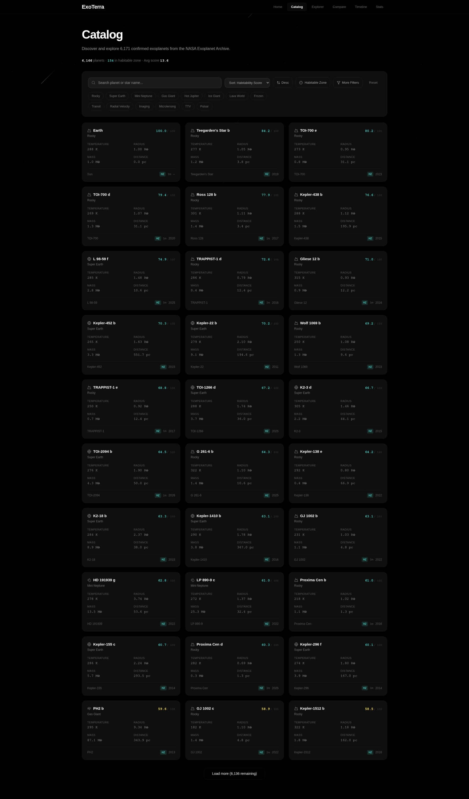
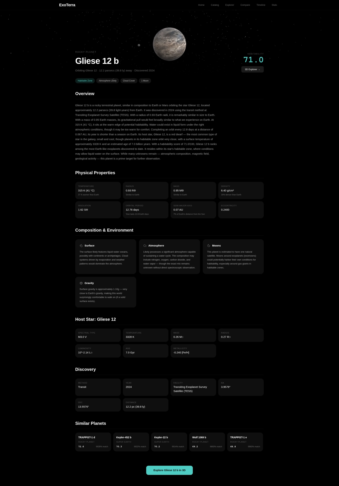
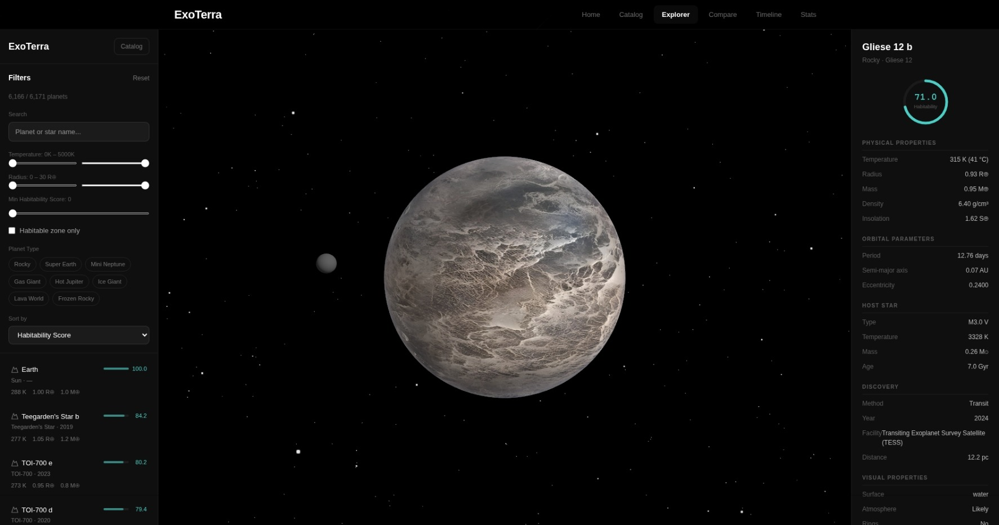
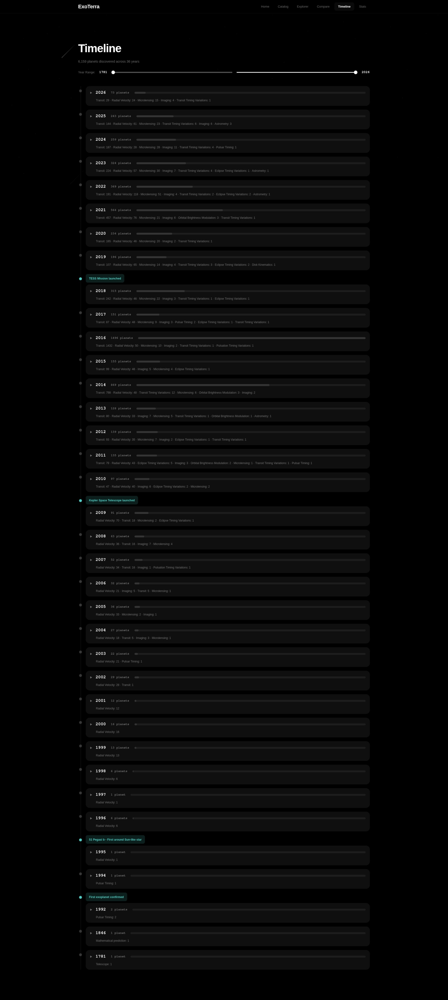

# 🪐 ExoTerra

ExoTerra es un explorador interactivo 3D diseñado para visualizar y analizar exoplanetas reales descubiertos por la NASA. Combina la potencia matemática y el rigor de los datos astronómicos con la belleza y la inmersión del renderizado 3D en la web, ofreciéndole al usuario una experiencia única en la que puede interactuar gráficamente con mundos ubicados más allá de nuestro sistema solar.

## 🚀 Dirección del Proyecto
El proyecto ExoTerra no solo busca ser un catálogo visual, sino también un motor de inferencia analítica en tiempo real y una plataforma educativa pionera. Hacia el futuro, el proyecto tiene como horizontes:
- **Catálogo Exhaustivo Espacial:** Seguir mapeando miles de exoplanetas mediante el procesamiento centralizado de datos (como los archivos generados por misiones Kepler, TESS, etc.).
- **Simulación Realista y Dinámica:** Profundizar los shaders GLSL personalizados (`planet.frag.glsl`) y los efectos de post-procesado para dar vida a la geología, anillos, múltiples lunas, meteorología exoplanetaria dependientes de la insolación estelar, excentricidad, temperatura o composición química.
- **Predicción de Habitabilidad y Clasificación:** Expandir el algoritmo PL/pgSQL procedural corriendo en la base de datos (Supabase). Éste calcula el `habitability_score` ponderando radio, masa, insolación y temperatura de equilibrio; infiriendo a su vez detalles científicos para visualizar mundos rocosos de lava, gigantes de hielo espectaculares y súper-tierras con océanos globales.

## 🛠️ Tecnologías Usadas para Generar el Sitio Web
La magia de ExoTerra y su proceso de auto-generación visual e interfaces han sido generados y soportados utilizando el siguiente stack tecnológico moderno:

- **Frontend y Arquitectura Base:** React 19, TypeScript y [Vite](https://vitejs.dev/) garantizando empaquetado y HMR ultra rápidos.
- **Renderizado 3D y Shaders:** [Three.js](https://threejs.org/) impulsado por `react-three-fiber` y `@react-three/drei` para el contexto 3D interactivo en WebGL, acompañado de Custom Shaders GLSL (`planet.frag.glsl`, `atmosphere...`) para procesar el render procedimental a bajo nivel.
- **Estilación y UI:** `TailwindCSS v4` para construir rápidamente los componentes astronómicos "glassmorphic" limpios. `Zustand` se utiliza para la gerencia liviana del estado local.
- **Base de Datos y Procedimientos (Backend):** [Supabase](https://supabase.io/) con PostgreSQL. En lugar de calcular cada gráfico localmente, potentes Triggers PL/pgSQL nativos generan matemáticamente un `habitability_score`, infieren colores de las atmósferas y densidades al momento de la inserción de datos.
- **Algoritmia e Ingesta:** Scripts diseñados en `Python` extraen, procesan y limpian la big-data astronómica pura desde los archivos CSV originales de la NASA.

## 📸 Galería del Proyecto

Aquí puedes dar un vistazo a cómo hemos enlazado los datos procedimentales para generar el universo de ExoTerra:

| Inicio / Home | Catálogo de Exoplanetas |
|:---:|:---:|
|  |  |

| Descripción y Atributos | Explorador Inmersivo 3D |
|:---:|:---:|
|  |  |

 

  <b>Línea de Tiempo (Timeline)</b> 
  

 

## ⚙️ Características Actuales
- 🌍 **Renderizado Procedural 3D Complejo**: Auto-generación de superficies (e.g. roca helada, agua habitable, gas joviano incandescente).
- 📡 **Catálogo Extendido Dinámico**: Visualización de sistemas estelares con filtrado y control de habitabilidad directo.
- 🔬 **Explorador Único (`ExplorerPage`)**: Detalles termodinámicos (temperatura de equilibrio $K$, luminosidad, metalicidades y edad precalculada de estrellas host).
- 🧑‍🚀 **Motor RLS y Computación en Supabase**: Las lógicas pesadas para inferencia se mantienen en DB para aligerar la responsividad y seguridad del cliente (Row Level Security activo).

## 🛠️ Instalación y Desarrollo Local

### 1. Requisitos Previos
- [Node.js](https://nodejs.org/) (v18+)
- [Python 3+](https://www.python.org/) (Para las utilidades script de ingesta)
- Un proyecto habilitado en [Supabase](https://supabase.io/) para replicar la DB.

### 2. Configurar la Infraestructura Base
Importa la estructura a tu nueva base de datos Supabase ejecutando en el editor SQL:
\`\`\`bash
# Refiérase al archivo principal del modelo
supabase_schema.sql
\`\`\`

### 3. Ingesta de la Base Astronómica
\`\`\`bash
# Configura tus variables en import_data.py y corre la semilla
python import_data.py nasa_data.csv
\`\`\`

### 4. Lanzar el Entorno Web
Clona tu propio repositorio (luego de hacer push) e instala el entorno Node:
\`\`\`bash
npm install
npm run dev
\`\`\`

¡Disfruta surcando la galaxia en `localhost:5173`! 🌌✨
